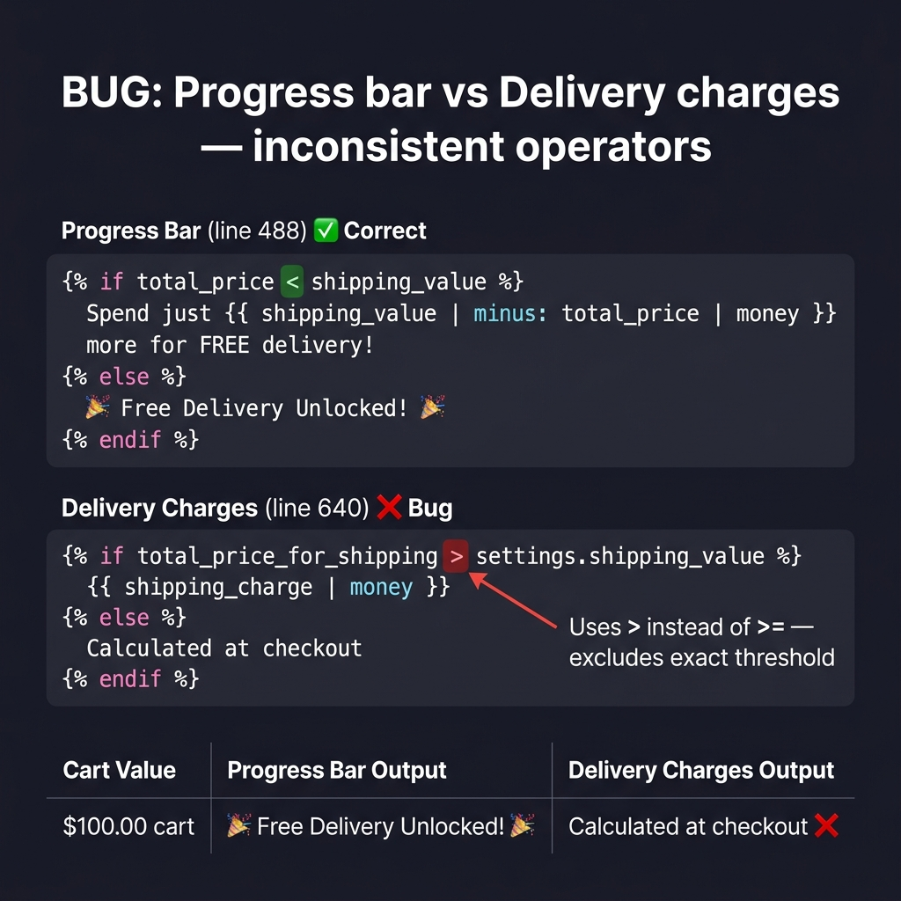
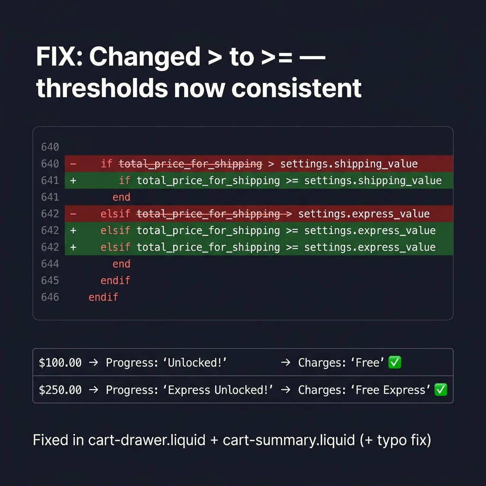

# xinzuo-shipping-fix

Fix for an off-by-one boundary bug in the cart drawer's free shipping threshold logic.

## The Bug

The cart drawer has two elements that talk about shipping: a progress bar and a delivery charges line. They use different comparison operators, so they disagree at the threshold.

**Progress bar** (line 488 of `cart-drawer.liquid`):
```liquid
if total_price < shipping_value
  → shows "Add $X more..."
else
  → shows "Free Delivery Unlocked!"
```
This is correct. At $100, it flips to "Unlocked".

**Delivery charges** (line 640 of `cart-drawer.liquid`):
```liquid
if total_price_for_shipping > settings.shipping_value
  → shows "Free"
else
  → shows "Calculated at checkout"
```
This uses `>` instead of `>=`. At exactly $100, it still says "Calculated at checkout".

**Result**: at $100, the progress bar says "Unlocked" and the delivery charges say "Calculated". Same drawer, opposite messages.

Same bug exists in `cart-summary.liquid` (the /cart page), which also had a typo: "Calcuated".

## The Fix

`>` → `>=` in four places across two files. That's it.

| File | Lines | What |
|---|---|---|
| `snippets/cart-drawer.liquid` | 640, 642 | Cart drawer delivery charges |
| `snippets/cart-summary.liquid` | 124, 126 | /cart page price summary |

## Before / After

| Before | After |
|---|---|
|  |  |

## Loom

> **TODO**: Paste your Loom URL here

## How I found it

I started by looking at the cart drawer code since the brief mentioned it. While reading through `cart-drawer.liquid`, I noticed the shipping progress bar logic around line 488 — it uses `< shipping_value` to decide when to flip from "add more" to "unlocked". Made sense.

Then I scrolled down to where the delivery charges actually render (line 640) and saw it uses `> shipping_value` — strict greater-than. That looked off. If the progress bar flips at `>=` the threshold (because `<` stops being true), but the charges only flip at `>` the threshold, then there's a gap: the exact threshold value falls through.

Opened `settings_data.json` to check: `shipping_value = 100`, `express_value = 250`. So at exactly $100, the bar says "Unlocked" but the charges say "Calculated at checkout". Checked `cart-summary.liquid` — same bug, plus a typo ("Calcuated"). Checked `main-cart.liquid` — the progress bar there was already correct, which confirmed this was a copy-paste inconsistency, not a deliberate choice.

